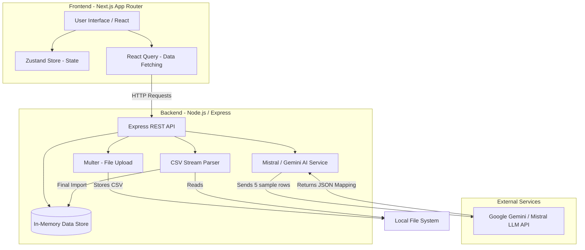

# GrowEasy AI Importer

An intelligent, AI-powered CSV import tool that leverages Large Language Models (Google Gemini) to automatically map unpredictable, messy CSV headers to a standard destination schema and seamlessly import records into your system. Built with **Next.js**, **Node.js (Express)**, and **Tailwind CSS v4 (Glassmorphism UI)**.

## 🌟 Project Overview

Importing CSV data is notoriously painful for end users. Columns rarely match your exact database schema, data types are often inconsistent, and basic rigid mapping rules constantly fail. 

**GrowEasy AI Importer** solves this by using AI. When a user uploads a CSV, the tool reads a small chunk of the uploaded data, infers the context and semantics of the columns, and automatically suggests a highly accurate mapping to your destination schema. Users can review, adjust if necessary, and then import thousands of rows smoothly.

## ✨ Key Features

- **🧠 AI-Powered Header Mapping**: Upload any CSV with arbitrary headers. The AI accurately maps them to the destination schema using semantic understanding, saving users from manual drudgery.
- **⚡ Robust Stream Processing**: Safely processes thousands of rows efficiently using stream parsing, skipping invalid rows without crashing the import.
- **📊 Detailed Analytics Dashboard**: Visualizes import trends (Recharts), success rates, and recent activity history in a stunning premium UI.
- **👀 Data Previews**: Full spreadsheet-like preview with horizontal scrolling and data insights before import.
- **📄 Comprehensive Reports**: Export import results as PDF or CSV (for both successful and skipped records).
- **🌗 Premium Glassmorphism UI**: Beautiful light and dark themes using custom Tailwind CSS v4 variables, glowing neon accents, and backdrop filters.

---

## 🏗️ Architecture

The application is built on a modern full-stack architecture separating the client-side experience from the heavy lifting on the server.

### Architecture Diagram



### Data Flow Lifecycle

1. **Upload Phase**: The user uploads a CSV via the Frontend. The Backend (`multer`) saves it locally and immediately extracts the headers and first 5 rows of data.
2. **AI Inference Phase**: The Backend sends these sample rows to the LLM with a strict JSON schema prompt. The AI infers the meaning of each column and pairs it with the required destination fields (e.g. mapping `First_Name` to `firstName`).
3. **Review Phase**: The AI returns a JSON mapping object. The Frontend displays this to the user in an interactive table, allowing them to review the confidence scores and manually override any mappings.
4. **Import Phase**: Once confirmed, the Frontend triggers the import process. The Backend streams the CSV, applies the mapping rules row-by-row, filters out invalid data, and saves successful records into the database.
5. **Results Phase**: The user is presented with a success/failure summary, analytics charts, and the option to export the reports.

---

## 🛠️ Tech Stack

### Frontend
- **Framework**: Next.js 14+ (App Router)
- **UI Library**: React, Shadcn UI
- **Styling**: Tailwind CSS v4, Lucide Icons
- **State Management**: Zustand (Client State), TanStack React Query (Server State)
- **Charts**: Recharts
- **Exporting**: jsPDF

### Backend
- **Framework**: Node.js, Express.js
- **File Handling**: Multer
- **Parsing**: `csv-parser`
- **AI Integration**: Google GenAI SDK (`@google/genai`) or Mistral AI SDK.
- **Database**: In-memory maps (Simulated for this demonstration, easily swappable for PostgreSQL/MongoDB).

---

## 📂 Folder Structure

```text
groweasy_Ai_Importer/
├── backend/
│   ├── src/
│   │   ├── config/          # Environment variables & constants
│   │   ├── controllers/     # Route handlers and business logic entry points
│   │   ├── middleware/      # Multer file upload & error handlers
│   │   ├── routes/          # Express route definitions
│   │   ├── services/        # Core business logic (AI, CSV Parsing, DB)
│   │   └── utils/           # Helper functions (Retry logic, file utils)
│   ├── .env                 # Backend Secrets (Ignored in Git)
│   └── package.json
│
├── frontend/
│   ├── src/
│   │   ├── app/             # Next.js App Router pages & layouts
│   │   ├── components/      # Reusable UI components (Dashboard, Charts, Forms)
│   │   ├── hooks/           # Custom React hooks (React Query wrappers)
│   │   ├── lib/             # Utility functions (Export to PDF/CSV, API client)
│   │   ├── providers/       # Theme & Query client providers
│   │   ├── store/           # Zustand state stores
│   │   └── types/           # TypeScript interfaces
│   ├── .env.local           # Frontend API URLs (Ignored in Git)
│   └── package.json
│
└── .gitignore               # Root gitignore ensuring no secrets are committed
```

---

## 🚀 Installation & Setup

### Prerequisites
- Node.js v18+
- A Google Gemini API Key (or Mistral API Key).

### 1. Clone the Repository
```bash
git clone <repository-url>
cd groweasy_Ai_Importer
```

### 2. Backend Setup
```bash
cd backend
npm install
```
Create a `.env` file in the `backend/` directory and add your AI credentials:
```env
PORT=5000
NODE_ENV=development
MAX_FILE_SIZE=5242880 # 5MB

# AI Provider Keys
GEMINI_API_KEY=your_gemini_api_key_here
```
Start the backend server:
```bash
npm run dev
```

### 3. Frontend Setup
Open a new terminal window:
```bash
cd frontend
npm install
```
Create a `.env.local` file in the `frontend/` directory (Optional, defaults to `localhost:5000`):
```env
NEXT_PUBLIC_API_URL=http://localhost:5000/api
```
Start the frontend server:
```bash
npm run dev
```

The application will be running at `http://localhost:3000`.

---

## 🔒 Security & Gitignore

This repository is configured to securely ignore sensitive files. The following are included in the `.gitignore`:
- `node_modules/` and `.next/` build outputs.
- `.env`, `.env.*` (All environment variables containing API keys).
- `backend/src/uploads/` (Ensures uploaded user CSV files are never committed to version control).
- `logs/` and `*.log` (Keeps debug logs local).

---

## 🔮 Future Improvements

- **Persistent Database**: Replace the in-memory data store with PostgreSQL/Prisma for production readiness.
- **Real-time WebSockets**: Upgrade the processing stage to use WebSockets or Server-Sent Events (SSE) for live row-by-row progress bars instead of polling.
- **Custom Schemas**: Allow users to define their own custom destination schemas dynamically from the frontend rather than relying on a hardcoded schema.
- **Background Workers**: Integrate BullMQ / Redis to offload massive CSV files (1M+ rows) into background worker processes to prevent API timeouts.
